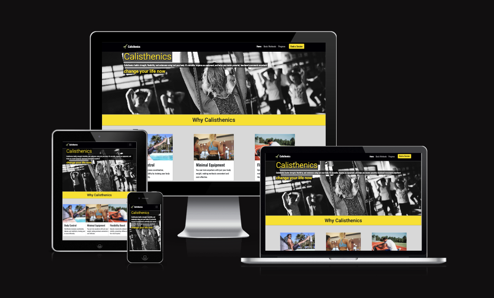
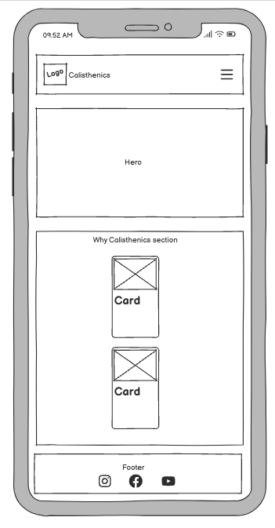
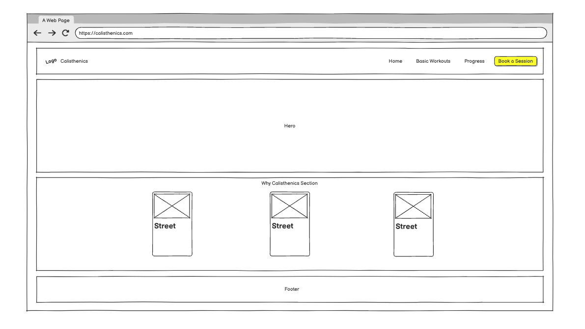
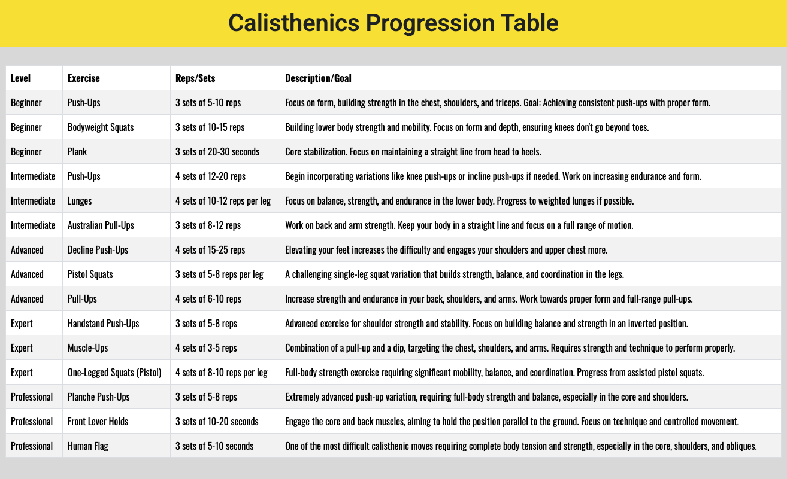
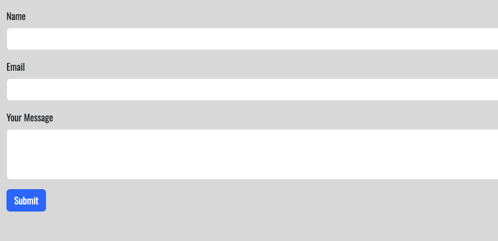
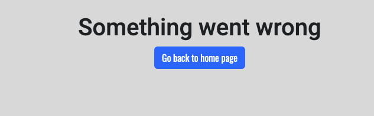
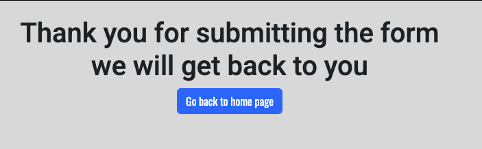
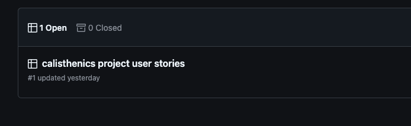
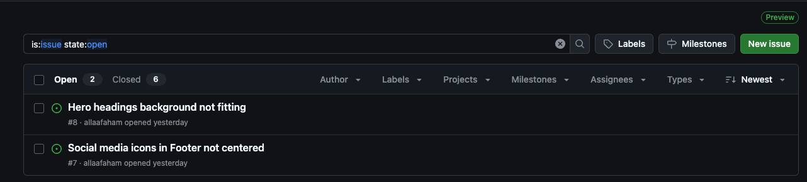
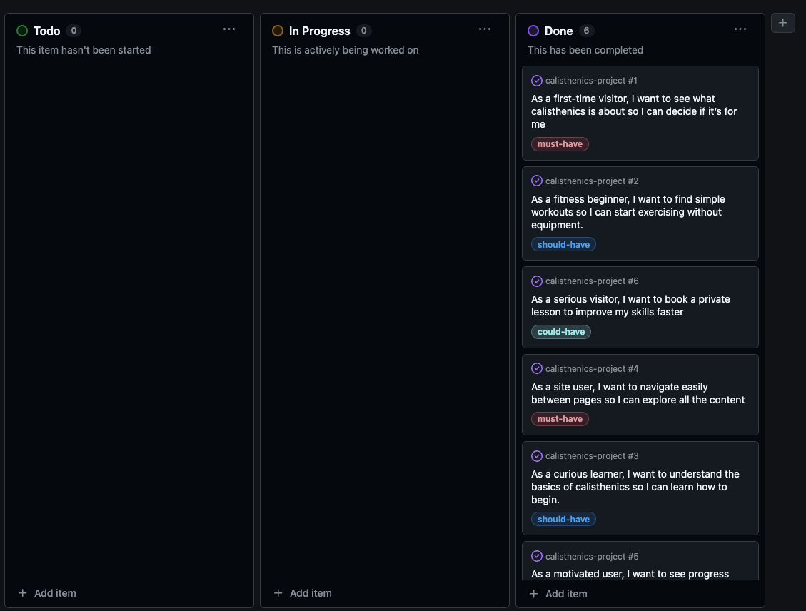

# [calisthenics-project](https://allaafaham.github.io/calisthenics-project)

This website is designed to help individuals improve their fitness through calisthenics, offering accessible workout routines, progress tracking, and personalized training sessions. It’s created for anyone interested in building strength using their own bodyweight, from beginners to those with more experience. With dedicated pages for basic exercises, tracking progress, and booking one-on-one sessions, the site provides everything users need to start, grow, and challenge themselves in their fitness journey. The exercises are clearly explained with descriptions, benefits, and instructions to ensure users perform them correctly. Whether someone is just getting started or looking to level up, this platform aims to keep users motivated, help them hit their goals, and build lasting fitness habits.

source: [calisthenics-project amiresponsive](https://ui.dev/amiresponsive?url=https://allaafaham.github.io/calisthenics-project)

> [!IMPORTANT]
> The examples in these templates are strongly influenced by the Code Institute walkthrough project called "Love Running".

## UX

### The 5 Planes of UX

#### 1. Strategy Plane
##### Purpose
- Encourage users to start training calisthenics by showcasing workout routines, benefits, and tips for each body part.
- Provide a seamless and motivating user experience to keep users coming back for their workout needs.

##### Primary User Needs
- Learn about the various calisthenics exercises for different body parts (upper body, lower body, warm-up).
- View descriptions of exercises for proper technique.
- Stay motivated with progress tracking.

##### Business Goals
- Increase site traffic and engagement.
- Promote health and fitness through calisthenics.

#### 2. Scope Plane
##### Features
- A full list of [Features](#features) can be viewed in detail below.

##### Content Requirements
- Detailed descriptions of each exercise in each category (Warm-up, Upper Body, Lower Body).
- Discriptions explaining proper exercise form.
- Form for private sessions.

#### 3. Structure Plane
##### Information Architecture
- **Navigation Menu**:
  - Links to Home, Basic Workouts, Progerss and a booking page
- **Hierarchy**:
  - Main Content: adjusted to fits each page's purpose. 

  - Prominent placement of social media links in the footer.

##### User Flow
1. User lands on the home page → sees a description of calisthenics benefits.
2. Navigates to the Basic Workouts section. 
3. Views exercise details → follows the instructions for each exercise.
4. Navigates to the progress and gets an idea of the different levels.
5. Navigates to the booking page. 

#### 4. Skeleton Plane
##### Wireframe Suggestions
- A full list of [Wireframes](#wireframes) can be viewed in detail below.

#### 5. Surface Plane
##### Visual Design Elements
- **[Colours](#colour-scheme)**: see below
- **[Typography](#typography)**: see below

### Colour Scheme

I chose the following colors based on my past experiences with sports websites and gyms, where these tones are often used to evoke strength, energy, and positivity. The combination of these colors is practical for creating a visually appealing design.

- `#000001` primary text.
- `#fbe51f` primary highlights.
- `#ffffff` secondary text.

### Typography

- [Roboto](https://fonts.google.com/specimen/Roboto) was used for the primary headers and titles.
- [Oswald](https://fonts.google.com/specimen/Oswald) was used for all other secondary text.
- [Font Awesome](https://fontawesome.com) icons were used throughout the site, such as the social media icons in the footer.

## User Stories

| Target | Expectation | Outcome |
| --- | --- | --- |
| As a first-time visitor | I want to see what calisthenics is about | so I can decide if it’s for me. |
| As a fitness beginner | I want to find simple workouts  | so I can start exercising without equipment. |
| As a serious visitor | I want to book a private lesson | so that I can improve my skills faster. |
| As an user | I want to navigate easily between pages | so I can explore all the content. |
| As a curious learner | I want to understand the basics of calisthenics | sso I can learn how to begin. |
| As a motivated user | I want to see progress goals | so I can feel inspired to keep going. |

## Wireframes

⚠️ INSTRUCTIONS ⚠️

If you've created wireframes or mock-ups, use this section to display screenshots of your wireframes. The example table below uses sample pages from the walkthrough project to give you some inspiration for your own project, so please adjust accordingly.

⚠️ --- END --- ⚠️

To follow best practice, wireframes were developed for mobile, tablet, and desktop sizes.
I've used [Balsamiq](https://balsamiq.com/wireframes) to design my site wireframes.

| Page | Mobile | Tablet | Desktop |
| --- | --- | --- | --- |
| Home |  |  |  |
| Gallery |  |  |  |
| Signup |  |  |  |
| Confirmation |  |  |  |
| 404 |  |  |  |

## Features

### Existing Features

| Feature        | Notes | Screenshot |
| -------------- | ----- | ----------- |
| Navbar         | Featured on all pages, the fully responsive navigation bar includes links to the **Home**, **Basic Workouts**, **Progress**, and **Booking** pages, as well as the site logo. It is identical on all pages to allow for easy navigation. On the smallest screens, an icon is used to toggle the navbar, saving space. This section allows the user to easily navigate between pages without returning to the previous page using the "back" button. |  |
| Hero Image     | The landing page includes a hero image with text-overlay to introduce the user to the website. The image grabs attention and provides context for the website theme. |  |
| Basic Workouts | This section provides the user with three workout categories: **Warm-up**, **Upper Body**, and **Lower Body**. Each category contains three exercises with descriptions, benefits, and instructions on how to perform each exercise correctly. This helps users easily learn and execute calisthenics exercises. |  |
| Progress       | The **Progress** page features a table showing different levels of calisthenics trainer expertise: **Beginner**, **Intermediate**, and **Professional**. This section helps users track their own progress and understand the skills required for each level. |  |
| Booking        | The **Booking** page allows users to book private sessions. The page includes a form where users can fill in their details. Upon successful submission, users are directed to a confirmation page. |  |
| Footer         | The footer includes links to the site's social media platforms, which open in a new tab for easy access. This section encourages users to stay connected through social media. |  |
| 404            | The **404 page** appears when users navigate to a non-existent page. It maintains the same design as the rest of the site with the standard navbar and footer, creating a seamless user experience. |  |
| Confirmation   | The **Confirmation page** appears after the user successfully fills out the form on the **Booking** page. It gives the illusion of a successful form submission, then automatically redirects the user back to the home page after 10 seconds. |  |

### Future Features

- **Personalized User Profiles**: Allow users to create accounts where they can track their progress in calisthenics, save their workout routines, and monitor improvements over time.
- **Customizable Workout Plans**: Offer customizable workout plans based on the user's experience level (beginner, intermediate, advanced). Users can receive notifications for scheduled workouts.
- **Interactive Exercise Guide**: Create interactive, step-by-step guides for each exercise, including images, videos, and real-time tips for proper form.
- **Leaderboard**: Display a leaderboard showing the top users based on the number of completed workouts, longest streaks, or best workout performance.
- **Weekly Challenges**: Introduce weekly challenges with specific exercises or workout goals that users can take part in, adding a fun and motivating element.
- **Social Sharing**: Allow users to share their workout progress, achievements, or favorite exercises directly on social media platforms.
- **Calisthenics Merchandise**: Add an online store where users can purchase branded workout gear, such as T-shirts, resistance bands, or workout mats.
- **Push Notifications**: Enable users to opt-in for notifications about new workout plans, progress reminders, or new blog posts..
- **Charity Workouts**: Partner with charities where users can participate in charity-themed workouts, track their progress, and raise awareness for good causes.

## Tools & Technologies

| Tool / Tech | Use |
| --- | --- |
|  | Generate README and TESTING templates. |
|  | Version control. (`git add`, `git commit`, `git push`) |
|  | Secure online code storage. |
|  | Local IDE for development. |
|  | Main site content and layout. |
|  | Design and layout. |
|  | Hosting the deployed front-end site. |
|  | Icons. |
|  | Utilize prebuilt grid system and components |

## Agile Development Process

### GitHub Projects

⚠️ TIP ⚠️

Consider adding screenshots of your Projects Board(s), Issues (open and closed), and Milestone tasks.

⚠️ --- END ---⚠️

[GitHub Projects](https://www.github.com/allaafaham/calisthenics-project/projects) served as an Agile tool for this project. Through it, EPICs, User Stories, issues/bugs, and Milestone tasks were planned, then subsequently tracked on a regular basis using the Kanban project board.

### GitHub Issues

[GitHub Issues](https://www.github.com/allaafaham/calisthenics-project/issues) served as an another Agile tool. There, I managed my User Stories and Milestone tasks, and tracked any issues/bugs.

| Link | Screenshot |
| --- | --- |
|  |  |
|  |  |

### MoSCoW Prioritization

I've decomposed my Epics into User Stories for prioritizing and implementing them. Using this approach, I was able to apply "MoSCow" prioritization and labels to my User Stories within the Issues tab.

- **Must Have**: guaranteed to be delivered - required to Pass the project (*max ~60% of stories*)
- **Should Have**: adds significant value, but not vital (*~20% of stories*)
- **Could Have**: has small impact if left out (*the rest ~20% of stories*)
- **Won't Have**: not a priority for this iteration - future features

## Testing

> [!NOTE]
> For all testing, please refer to the [TESTING.md](TESTING.md) file.

## Deployment

### GitHub Pages

The site was deployed to GitHub Pages. The steps to deploy are as follows:

- In the [GitHub repository](https://www.github.com/allaafaham/calisthenics-project), navigate to the "Settings" tab.
- In Settings, click on the "Pages" link from the menu on the left.
- From the "Build and deployment" section, click the drop-down called "Branch", and select the **main** branch, then click "Save".
- The page will be automatically refreshed with a detailed message display to indicate the successful deployment.
- Allow up to 5 minutes for the site to fully deploy.

The live link can be found on [GitHub Pages](https://allaafaham.github.io/calisthenics-project).

### Local Development

This project can be cloned or forked in order to make a local copy on your own system.

#### Cloning

You can clone the repository by following these steps:

1. Go to the [GitHub repository](https://www.github.com/allaafaham/calisthenics-project).
2. Locate and click on the green "Code" button at the very top, above the commits and files.
3. Select whether you prefer to clone using "HTTPS", "SSH", or "GitHub CLI", and click the "copy" button to copy the URL to your clipboard.
4. Open "Git Bash" or "Terminal".
5. Change the current working directory to the location where you want the cloned directory.
6. In your IDE Terminal, type the following command to clone the repository:
	- `git clone https://www.github.com/allaafaham/calisthenics-project.git`
7. Press "Enter" to create your local clone.

Alternatively, if using Gitpod, you can click below to create your own workspace using this repository.

**Please Note**: in order to directly open the project in Gitpod, you should have the browser extension installed. A tutorial on how to do that can be found [here](https://www.gitpod.io/docs/configure/user-settings/browser-extension).

#### Forking

By forking the GitHub Repository, you make a copy of the original repository on our GitHub account to view and/or make changes without affecting the original owner's repository. You can fork this repository by using the following steps:

1. Log in to GitHub and locate the [GitHub Repository](https://www.github.com/allaafaham/calisthenics-project).
2. At the top of the Repository, just below the "Settings" button on the menu, locate and click the "Fork" Button.
3. Once clicked, you should now have a copy of the original repository in your own GitHub account!

### Local VS Deployment

There are no remaining major differences between the local version when compared to the deployed version online.

## Credits

### Content

| Source | Notes |
| --- | --- |
| [Markdown Builder](https://markdown.2bn.dev) | Help generating Markdown files |
| [Chris Beams](https://chris.beams.io/posts/git-commit) | "How to Write a Git Commit Message" |
| [Love Running](https://codeinstitute.net) | Code Institute walkthrough project inspiration |
| [ChatGPT](https://chatgpt.com) | Help with code logic and explanations |

### Media

| Source | Notes |
| --- | --- |
| [favicon.io](https://favicon.io) | Generating the favicon |
| [Love Running](https://codeinstitute.net) | Sample images provided from the walkthrough projects |
| [Font Awesome](https://fontawesome.com) | Icons used throughout the site |
| [Pexels](https://images.pexels.com/photos/416160/pexels-photo-416160.jpeg) | Hero image |
| [Wallhere](https://c.wallhere.com/images/9c/c8/da4b4009f070c8e1dfee43d25f99-2318808.jpg!d) | Background wallpaper |
| [Pixabay](https://cdn.pixabay.com/photo/2017/09/04/16/58/passport-2714675_1280.jpg) | Background wallpaper |
| [DALL-E 3](https://openai.com/index/dall-e-3) | AI generated artwork |
| [TinyPNG](https://tinypng.com) | Compressing images < 5MB |
| [CompressPNG](https://compresspng.com) | Compressing images > 5MB |
| [CloudConvert](https://cloudconvert.com/webp-converter) | Converting images to `.webp` |

### Acknowledgements

- I would like to thank my Code Institute mentor, [Tim Nelson](https://www.github.com/TravelTimN) for the support throughout the development of this project.
- I would like to thank the [Code Institute](https://codeinstitute.net) Tutor Team for their assistance with troubleshooting and debugging some project issues.
- I would like to thank the [Code Institute Slack community](https://code-institute-room.slack.com) for the moral support; it kept me going during periods of self doubt and impostor syndrome.
