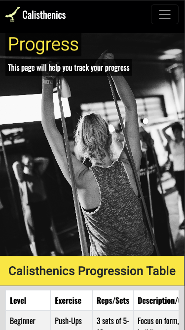
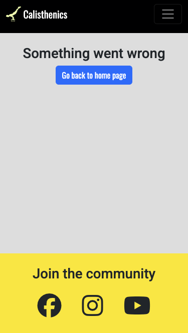
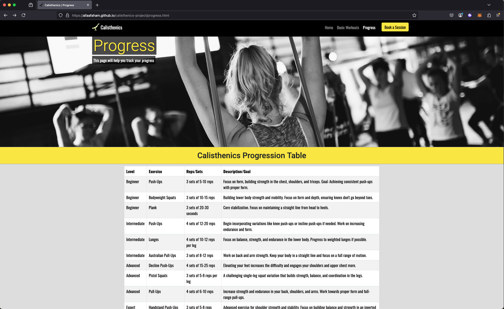
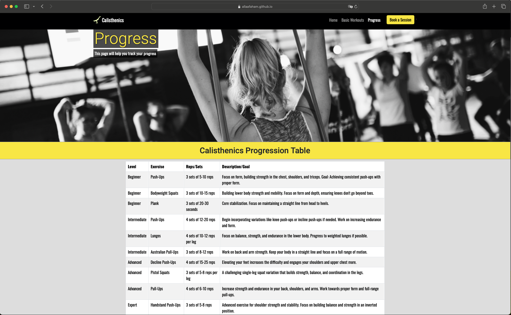

# Testing

> [!NOTE]
> Return back to the [README.md](README.md) file.

## Code Validation

### HTML

I have used the recommended [HTML W3C Validator](https://validator.w3.org) to validate all of my HTML files.

| Directory | File | URL | Screenshot | Notes |
| --- | --- | --- | --- | --- |
|  | [404.html](https://github.com/allaafaham/calisthenics-project/blob/main/404.html) | [HTML Validator](https://validator.w3.org/nu/?doc=https://allaafaham.github.io/calisthenics-project/404.html) |  |
|  | [basic-workouts.html](https://github.com/allaafaham/calisthenics-project/blob/main/basic-workouts.html) | [HTML Validator](https://validator.w3.org/nu/?doc=https://allaafaham.github.io/calisthenics-project/basic-workouts.html) |  |  |
|  | [booking.html](https://github.com/allaafaham/calisthenics-project/blob/main/booking.html) | [HTML Validator](https://validator.w3.org/nu/?doc=https://allaafaham.github.io/calisthenics-project/booking.html) |  |  |
|  | [index.html](https://github.com/allaafaham/calisthenics-project/blob/main/index.html) | [HTML Validator](https://validator.w3.org/nu/?doc=https://allaafaham.github.io/calisthenics-project/index.html) |  |  |
|  | [progress.html](https://github.com/allaafaham/calisthenics-project/blob/main/progress.html) | [HTML Validator](https://validator.w3.org/nu/?doc=https://allaafaham.github.io/calisthenics-project/progress.html) |  |  |
|  | [success.html](https://github.com/allaafaham/calisthenics-project/blob/main/success.html) | [HTML Validator](https://validator.w3.org/nu/?doc=https://allaafaham.github.io/calisthenics-project/success.html) |  |  |

### CSS

I have used the recommended [CSS Jigsaw Validator](https://jigsaw.w3.org/css-validator) to validate all of my CSS files.

| Directory | File | URL | Screenshot | Notes |
| --- | --- | --- | --- | --- |
| assets | [style.css](https://github.com/allaafaham/calisthenics-project/blob/main/assets/css/style.css) | [CSS Validator](https://jigsaw.w3.org/css-validator/validator?uri=https://allaafaham.github.io/calisthenics-project) |  |

## Responsiveness

All pages were thoroughly tested for responsiveness across screen sizes starting from 320px and above

| Page | Mobile | Tablet | Desktop | Notes |
| --- | --- | --- | --- | --- |
| Home |  |  |  | Works as expected |
| Basic Workouts |  |  |  | Works as expected |
| Progress |  |  |  | Works as expected |
| Booking |  |  |  | Works as expected |
| 404 |  |  |  | Works as expected |
ipad

## Browser Compatibility

I've tested my deployed project on multiple browsers to check for compatibility issues.

| Page | Chrome | Firefox | Safari | Notes |
| --- | --- | --- | --- | --- |
| Home |  |  |  | Works as expected |
| Basic Workouts |  |  |  | Works as expected |
| Progress |  |  |  | Works as expected |
| Booking |  |  |  | Works as expected |
| 404 |  |  |  | Works as expected |
| success |  |  |  | Works as expected |

## Lighthouse Audit

I've tested my deployed project using the Lighthouse Audit tool to check for any major issues. Some warnings are outside of my control, and mobile results tend to be lower than desktop.

| Page | Mobile | Desktop |
| --- | --- | --- |
| Home |  |  |
| Basic Workouts |  |  |
| Progress |  |  |
| Booking |  |  |
| 404 |  |  |
| success |  |  |

## User Story Testing

| Target | Expectation | Outcome | Pass | 
| --- | --- | --- | --- | 
| As a first-time visitor | I want to see what calisthenics is about | so that I can decide if it's for me. | x |
| As a fitness beginner | I want to find simple workouts | so that I can start exercising without equipment. | x |
| As a serious visitor | I want to book a private lesson | so that I can improve my skills faster. | x |
| As a site user | I want to navigate easily between pages | so that I can explore all the content. | x |
| As a curious learner | I want to understand the basics of calisthenics | so that I can learn how to begin. | x |
| As a motivated user | I want to see progress goals | so that I can feel inspired to keep going. | x |

### Known Issues

| Issue | Screenshot |
| --- | --- |
| Performance audit on mobile screen is less than 90%|  |
| 

> [!IMPORTANT]
> There are no remaining bugs that I am aware of, though, even after thorough testing, I cannot rule out the possibility.

